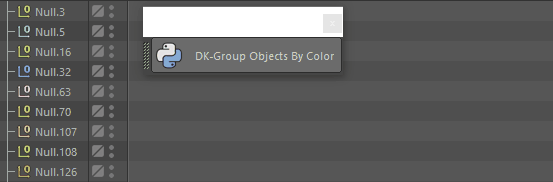
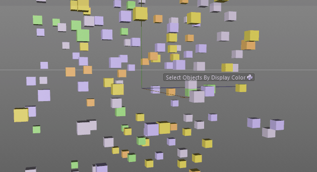

# dk-sandbox
A Collection of Experimental Scripts for Cinema 4D.

## Scripts

- **DK-Aim At:** Aims Z-Axis of selected objects at the last selected object.  

- **DK-Group Objects By Display Color:**  Groups all objects in scene by display color.
WARNING: Breaks existing parent/child relationships and deformer/generator setups.  

- **Import Textures as Materials:** Select a directory and load the textures. 

- **Preview Next Ranged Marker:** Adjust document's preview range to show next named marker with a length.

- **DK-Select By Display Color:** Selects Objects with the same Display Color  

- **DK-Select Similar Instances:** Selects all Instances of the Selected Object(s)
